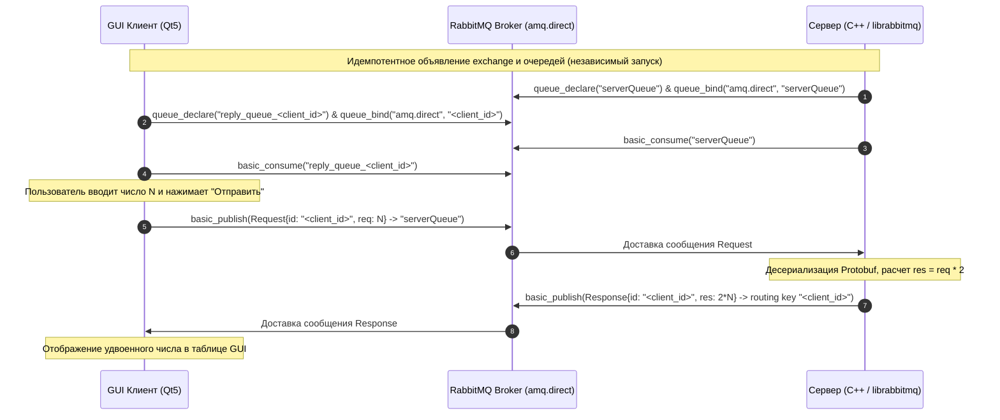

# RabbitMQ Qt Client-Server

[](https://en.wikipedia.org/wiki/C%2B%2B)
[](https://cmake.org/)
[](https://www.qt.io/)
[](https://www.rabbitmq.com/)
[](https://developers.google.com/protocol-buffers)
[](https://github.com/google/googletest)

Проект клиент-серверного взаимодействия на C++ с использованием брокера сообщений **RabbitMQ** (AMQP 0-9-1, библиотека `librabbitmq-c`), сериализации сообщений через **Google Protocol Buffers**, графического интерфейса клиента на **Qt5 Widgets** и автоматизированного тестирования на **Google Test**.

Разработано в соответствии с требованиями НИЦ СПб ЭТУ.

---

## 📌 Содержание
- [Обзор архитектуры](#-обзор-архитектуры)
- [Сетевой протокол (Protobuf)](#-сетевой-протокол-protobuf)
- [Схема взаимодействия (Sequence Diagram)](#-схема-взаимодействия-sequence-diagram)
- [Текущий статус проекта (Что уже сделано)](#-текущий-статус-проекта-что-уже-сделано)
- [Структура проекта](#-структура-проекта)
- [Сборка и запуск](#-сборка-и-запуск)

---

## 🏗 Обзор архитектуры

В проекте реализован шаблон **RPC (Remote Procedure Call)** поверх RabbitMQ:

1. **Тип Exchange**: выбран `direct` exchange (`amq.direct`).
   - Запросы всех клиентов поступают в единую очередь сервера по фиксированному ключу маршрутизации (например, `serverQueue`).
   - Ответы маршрутизируются сервером обратно конкретному клиенту по уникальному ключу маршрутизации, равному идентификатору клиента `client_id`.
2. **Поддержка нескольких клиентов**:
   - Каждый экземпляр клиента генерирует уникальный идентификатор `client_id` (на базе `QUuid`).
   - Клиент создает персональную очередь для ответов и привязывает её к exchange с routing key = `client_id`.
   - Поле `id` запроса указывает серверу, в какой routing key направить ответ. Это гарантирует изоляцию потоков ответов: клиенты не перехватывают чужие сообщения.
3. **Независимость порядка запуска**:
   - И клиент, и сервер идемпотентно объявляют необходимые сущности (`passive = 0`, `durable = 1` для очереди запросов).
   - При запуске клиента раньше сервера сообщения запросов безопасно сохраняются в очереди RabbitMQ до старта сервера.
   - При запуске сервера раньше клиентов он ожидает поступления сообщений в готовую очередь.

---

## 📜 Сетевой протокол (Protobuf)

Контракт обмена данными определен в `src/common/Messages.proto`:

```protobuf
syntax = "proto2";

package TestTask.Messages;

message Request {
    required string id = 1; // Уникальный идентификатор клиента (UUID)
    required int32 req = 2; // Число, передаваемое для удвоения
}

message Response {
    required string id = 1; // Идентификатор клиента, сделавшего запрос
    required int32 res = 2; // Результат удвоения числа (req * 2)
}
```

---

## 🔄 Схема взаимодействия (Sequence Diagram)



---

## ✅ Текущий статус проекта (Что уже сделано)

### Этап 1. Базовая архитектура, сборка и общие модули — Выполнено ✅
- [x] **Система сборки на CMake** (стандарт C++17):
  - Автогенерация исходного кода C++ из `Messages.proto` средствами CMake (`find_package(Protobuf REQUIRED)`, `protobuf_generate_cpp`).
  - Создана библиотека `common` (статическая линковка), используемая сервером, клиентом и модульными тестами.
  - Настроена конфигурация всех таргетов: `rabbitmq_server`, `rabbitmq_client`, `unit_tests`.
- [x] **Модуль `Config`**:
  - Чтение и запись параметров конфигурации через `QSettings` (формат `.ini`).
  - Управление секцией `[Broker]` (host, port, vhost, username, password, exchange, request_queue).
  - Управление секцией `[Logging]` (log_path, log_level).
  - Созданы готовые конфигурационные файлы [configs/server.ini](configs/server.ini) и [configs/client.ini](configs/client.ini).
- [x] **Модуль `Logger`**:
  - Потокобезопасная запись логов (с использованием `QMutex`).
  - Уровни логирования: `DEBUG`, `INFO`, `WARN`, `ERROR`.
  - Форматированный вывод даты/времени, уровня и текста сообщения одновременно в файл и консоль.
- [x] **Сетевой контракт `Messages.proto`**:
  - Описание protobuf-сообщений `Request(id, req)` и `Response(id, res)`.

### Этап 2. Серверная логика `rabbitmq_server` — Выполнено ✅
- [x] **Инициализация и конфигурация**:
  - Чтение пути из `argv[1]` либо `configs/server.ini` с автоматическим поиском.
  - Инициализация и форматированное логирование параметров запуска в `server.log`.
- [x] **Сетевое соединение и топология RabbitMQ**:
  - Создание AMQP-соединения, сокета TCP, авторизация в виртуальном хосте (`amqp_login`).
  - Идемпотентное объявление direct exchange `amq.direct` (durable = 1).
  - Идемпотентное объявление очереди запросов `serverQueue` (durable = 1).
  - Привязка очереди к exchange с routing key = `serverQueue`.
  - Регистрация консьюмера (`amqp_basic_consume`, no_ack = 0).
- [x] **Бизнес-логика и обработка сообщений (`Worker`)**:
  - Чтение сообщений с таймаутом (250 мс) для мгновенной реакции на сигналы завершения.
  - Десериализация Protobuf `Request`.
  - Удвоение числа `res = req * 2` с защитой от переполнения 32-битного знакового `int`.
  - Формирование ответа `Response` и публикация в direct exchange по ключу `request.id()`.
  - Отправка подтверждения `amqp_basic_ack`.
- [x] **Graceful Shutdown**:
  - Обработка сигналов `SIGINT` и `SIGTERM`.
  - Корректное закрытие канала (`amqp_channel_close`), соединения (`amqp_connection_close`) и сокета.

### Этап 3. Сетевой воркер и графический клиент `rabbitmq_client` — Выполнено ✅
- [x] **Фоновый воркер `ClientWorker` (на базе `QThread`)**:
  - Вынос блокирующих операций с сетью из GUI-потока в рабочий поток.
  - Потокобезопасная очередь запросов (`QMutex`).
  - Связь с интерфейсом через систему сигналов и слотов Qt (`queued connection`).
- [x] **Инициализация клиента и персональная очередь**:
  - Генерация уникального `client_id` на базе UUID (`client_<UUID>`).
  - Создание временной эксклюзивной очереди ответов `reply_<client_id>` (`exclusive = 1`, `auto_delete = 1`).
  - Привязка очереди ответов к `amq.direct` с routing key = `client_id`.
  - Идемпотентное объявление очереди `serverQueue` (гарантирует сохранение запросов при старте клиента до сервера).
- [x] **Графический интерфейс на чистом C++ (Qt Widgets)**:
  - `MainWindow`: ввод числа в `QSpinBox`, кнопка «Отправить запрос», интерактивная таблица истории запросов/ответов.
  - Динамическое обновление статусов («Ожидание ответа...» -> «Успешно»).
  - Цветовая индикация состояния соединения в статус-баре.
- [x] **Горячее переподключение**:
  - Диалог настроек `SettingsDialog` для изменения параметров брокера.
  - Применение новых настроек без перезапуска приложения через `ClientWorker::updateConfig`.

### Этап 4. Расширенное модульное тестирование (`Google Test`) — Выполнено ✅
- [x] **Тесты бизнес-логики вычислений (`WorkerTest`)**:
  - Удвоение нуля, положительных и отрицательных чисел.
  - Граничные допустимые значения (`INT32_MAX / 2`, `INT32_MIN / 2`).
  - Защита от переполнения и андерфлоу (`INT32_MAX`, `INT32_MIN`) с безопасным ограничением значений.
- [x] **Тесты устойчивости протокола Protobuf (`ProtobufTest`)**:
  - Сериализация и десериализация сообщений `Request` и `Response`.
  - Проверка отсутствия обязательных полей (`IsInitialized() == false`).
  - Передача поврежденных и пустых бинарных данных (валидация возврата `false`).
- [x] **Тесты конфигурации (`ConfigTest`)**:
  - Проверка значений по умолчанию и сквозного сохранения/загрузки `.ini`.
  - Обработка некорректных и несуществующих путей (сохранение дефолтных настроек).
  - Защита от сохранения без указания пути.
- [x] **Тесты логгера (`LoggerTest`)**:
  - Двусторонняя конвертация строковых уровней логирования в enum и обратно.
  - Проверка реальной записи в файл и фильтрации сообщений по уровню (`DEBUG`/`INFO`/`WARN`/`ERROR`).
- [x] **Результат**: 100% тестов пройдены успешно (12 из 12).

---

## 📁 Структура проекта

```text
rabbitmq-qt-client-server/
├── CMakeLists.txt              # Корневой CMake файл проекта
├── README.md                   # Документация и план проекта
├── configs/                    # Файлы конфигурации по умолчанию (.ini)
│   ├── client.ini              # Настройки брокера и логирования клиента
│   └── server.ini              # Настройки брокера и логирования сервера
├── src/
│   ├── common/                 # Общая библиотека (Protobuf, Config, Logger)
│   │   ├── CMakeLists.txt
│   │   ├── Messages.proto      # Protocol Buffers контракт сообщений
│   │   ├── Config.h / .cpp     # Парсер и менеджер .ini файлов (QSettings)
│   │   └── Logger.h / .cpp     # Потокобезопасный файловый логгер
│   ├── server/                 # Серверное консольное приложение
│   │   ├── CMakeLists.txt
│   │   ├── Server.h / .cpp
│   │   ├── Worker.h / .cpp
│   │   └── main.cpp
│   └── client/                 # Клиентское приложение с GUI (Qt5)
│       ├── CMakeLists.txt
│       ├── MainWindow.h / .cpp            # Главное окно приложения (чистый C++ GUI)
│       ├── SettingsDialog.h / .cpp        # Диалог настроек (чистый C++ GUI)
│       └── main.cpp
└── test/                       # Модульные тесты (Google Test)
    ├── CMakeLists.txt
    └── main_test.cpp           # Тесты Protobuf, Config, Logger
```

---

## 🔨 Сборка и запуск

### 1. Зависимости
В системе должны быть установлены:
- Компилятор C++ с поддержкой C++17 (GCC / Clang)
- CMake 3.15+
- Qt 5 (модули `Qt5Core`, `Qt5Widgets`)
- Protocol Buffers компилятор и библиотека (`libprotobuf-dev`, `protobuf-compiler`)
- `librabbitmq-dev`
- `libgtest-dev`

### 2. Сборка проекта
```bash
# Создание каталога сборки
cmake -B build -S .

# Сборка всех таргетов (server, client, tests)
cmake --build build -j$(nproc)
```

### 3. Запуск тестов
```bash
cd build
ctest --output-on-failure
```

### 4. Запуск приложений
```bash
# Запуск сервера
./build/src/server/rabbitmq_server

# Запуск графического клиента
./build/src/client/rabbitmq_client
```
