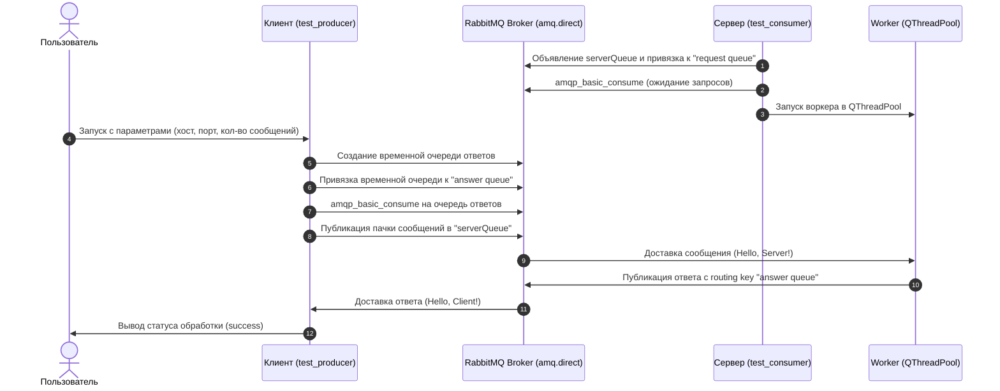

# RabbitMQ Qt Client-Server

[](https://en.wikipedia.org/wiki/C%2B%2B)
[](https://cmake.org/)
[](https://www.qt.io/)
[](https://www.rabbitmq.com/)
[](https://developers.google.com/protocol-buffers)
[]()

Клиент-серверное приложение на C++ для обмена сообщениями через брокер **RabbitMQ** (протокол AMQP 0-9-1) с использованием библиотеки **`librabbitmq-c`**, пула потоков **Qt5 (`QThreadPool` / `QRunnable`)** и сериализации через **Google Protocol Buffers**.

---

## 📌 Содержание

- [Обзор архитектуры](#-обзор-архитектуры)
- [Схема взаимодействия](#-схема-взаимодействия)
- [Структура проекта](#-структура-проекта)
- [Требования и зависимости](#-требования-и-зависимости)
- [Настройка RabbitMQ](#-настройка-rabbitmq)
- [Сборка проекта](#-сборка-проекта)
- [Запуск и использование](#-запуск-и-использование)
- [Спецификация сообщений (Protobuf)](#-спецификация-сообщений-protobuf)
- [Планы развития (Roadmap)](#-планы-развития-roadmap)

---

## 🏗 Обзор архитектуры

Проект реализует асинхронную модель обмена сообщениями типа **Request-Response (RPC)** через RabbitMQ:

1. **Сервер (`test_consumer`)**:
   - Подключается к брокеру RabbitMQ и слушает очередь `serverQueue`.
   - Очередь привязана к стандартному direct exchange `amq.direct` с routing key `request queue`.
   - Прием и обработка сообщений вынесены в отдельный воркер `Worker` (наследуется от `QRunnable`) и управляются через `QThreadPool`.
   - Обрабатывает системные события AMQP-фреймов (ACK, RETURN, CHANNEL_CLOSE, CONNECTION_CLOSE).
   - Отправляет ответные сообщения в `amq.direct` с routing key `answer queue`.

2. **Клиент (`test_producer`)**:
   - Подключается к RabbitMQ и объявляет временную эксклюзивную очередь для получения ответов.
   - Привязывает временную очередь к routing key `answer queue`.
   - Запускает `consume` на очередь ответов, после чего пачкой (`batch`) отправляет сообщения в очередь `serverQueue`.
   - Ожидает и валидирует получение всех ответов от сервера.

---

## 🔄 Схема взаимодействия



---

## 📁 Структура проекта

```text
rabbitmq-qt-client-server/
├── CMakeLists.txt              # Главный файл конфигурации сборки CMake
├── README.md                   # Краткое описание репозитория
├── readme280926.md             # Полная документация проекта для GitHub
├── src/
│   ├── client/                 # Модуль клиента (Producer)
│   │   ├── CMakeLists.txt
│   │   ├── Client.h            # Заголовочный файл класса Client
│   │   ├── Client.cpp          # Реализация подключения, отправки и чтения ответов
│   │   └── main.cpp            # Точка входа клиента (парсинг CLI параметров)
│   ├── server/                 # Модуль сервера (Consumer)
│   │   ├── CMakeLists.txt
│   │   ├── Server.h            # Заголовочный файл класса Server (управление QThreadPool)
│   │   ├── Server.cpp          # Реализация инициализации сервера
│   │   ├── Worker.h            # Класс Worker (QRunnable для AMQP consume)
│   │   ├── Worker.cpp          # Логика чтения сообщений и отправки ответов
│   │   └── main.cpp            # Точка входа сервера (инициализация сокета и очередей)
│   └── protocol/               # Спецификация сетевого протокола
│       ├── CMakeLists.txt
│       └── Messages.proto      # Protocol Buffers v2 схемы сообщений
└── test/                       # Модульные и интеграционные тесты
    ├── client/
    │   └── CMakeLists.txt
    └── server/
        └── CMakeLists.txt
```

---

## ⚙️ Требования и зависимости

Для сборки и запуска необходимы:

- **Компилятор C++**: GCC (версия 7+) или Clang с поддержкой C++14/C++17
- **CMake**: версия 3.15 или выше
- **Qt5**: модуль `Qt5::Core`
- **librabbitmq-c**: библиотека клиента C AMQP ([rabbitmq-c](https://github.com/alanxz/rabbitmq-c))
- **Google Protocol Buffers** (опционально, для интеграции схем): `protobuf-compiler`, `libprotobuf-dev`
- **Boost** (опционально для асинхронных воркеров): `Boost.Asio`

### Установка зависимостей в Ubuntu / Debian:

```bash
sudo apt-get update
sudo apt-get install -y \
    build-essential \
    cmake \
    qtbase5-dev \
    librabbitmq-dev \
    libprotobuf-dev \
    protobuf-compiler \
    libboost-all-dev \
    rabbitmq-server
```

---

## 🐰 Настройка RabbitMQ

По умолчанию проект использует выделенный виртуальный хост и учетные данные:

| Параметр | Значение |
| :--- | :--- |
| **Virtual Host (vhost)** | `rabbitmq_qt` |
| **Пользователь** | `rabbitmq_qt_user` |
| **Пароль** | `rabbitmqqt` |
| **Порт брокера** | `5672` |
| **Exchange** | `amq.direct` |
| **Очередь запросов** | `serverQueue` |
| **Routing Key запроса** | `request queue` |
| **Routing Key ответа** | `answer queue` |

### Создание пользователя и прав доступа:

```bash
# Создание vhost
sudo rabbitmqctl add_vhost rabbitmq_qt

# Создание пользователя
sudo rabbitmqctl add_user rabbitmq_qt_user rabbitmqqt

# Выдача прав администратора на vhost
sudo rabbitmqctl set_permissions -p rabbitmq_qt rabbitmq_qt_user ".*" ".*" ".*"

# (Опционально) Назначение тега administrator
sudo rabbitmqctl set_user_tags rabbitmq_qt_user administrator
```

---

## 🔨 Сборка проекта

1. Клонируйте репозиторий:
   ```bash
   git clone <URL_РЕПОЗИТОРИЯ>
   cd rabbitmq-qt-client-server
   ```

2. Создайте каталог для сборки и выполните конфигурирование:
   ```bash
   mkdir build && cd build
   cmake ..
   ```

3. Запустите сборку:
   ```bash
   cmake --build . -j$(nproc)
   ```

В результате в каталоге `build/` будут собраны два исполняемых файла:
- `test_consumer` — сервер
- `test_producer` — клиент

---

## 🚀 Запуск и использование

### 1. Запуск сервера (`test_consumer`)

Сервер принимает адрес и порт хоста RabbitMQ:

```bash
./test_consumer <hostname> <port>
```

**Пример:**
```bash
./test_consumer localhost 5672
```

Сервер подключится к брокеру, создаст/проверит очередь `serverQueue`, запустит фоновый рабочий поток и перейдет в режим ожидания сообщений.

---

### 2. Запуск клиента (`test_producer`)

Клиент принимает хост, порт и количество сообщений в пачке:

```bash
./test_producer <hostname> <port> <message_count>
```

**Пример:**
```bash
./test_producer localhost 5672 5
```

**Вывод клиента:**
```text
sent 'Hello, Server!' message
sent 'Hello, Server!' message
sent 'Hello, Server!' message
sent 'Hello, Server!' message
sent 'Hello, Server!' message
server messsage is Hello, Client!
server messsage is Hello, Client!
server messsage is Hello, Client!
server messsage is Hello, Client!
server messsage is Hello, Client!
success
```

---

## 📜 Спецификация сообщений (Protobuf)

В директории `src/protocol/Messages.proto` определен контракт обмена данными:

```protobuf
syntax = "proto2";

package TestTask.Messages;

message Request {
    required string id = 1; // Идентификатор клиента
    required int32 req = 2; // Код или тело запроса
}

message Response {
    required string id = 1; // Идентификатор клиента
    required int32 res = 2; // Код или результат ответа
}
```

---

## 🗺 Планы развития (Roadmap)

- [x] Базовый обмен сообщениями клиент-сервер через `amq.direct` без многопоточности.
- [x] Обработка входящих сообщений на сервере в пуле потоков `QThreadPool` (`Worker : public QRunnable`).
- [ ] Интеграция генерации C++ классов из `Messages.proto` в `CMakeLists.txt` и сериализация/десериализация пейлоадов.
- [ ] Реализация асинхронной обработки нескольких воркеров с использованием `Boost.Asio`.
- [ ] Разработка графического интерфейса пользователя (GUI) клиента на **Qt Widgets / QML**.
- [ ] Расширение модульного тестирования в каталогах `test/client` и `test/server`.
